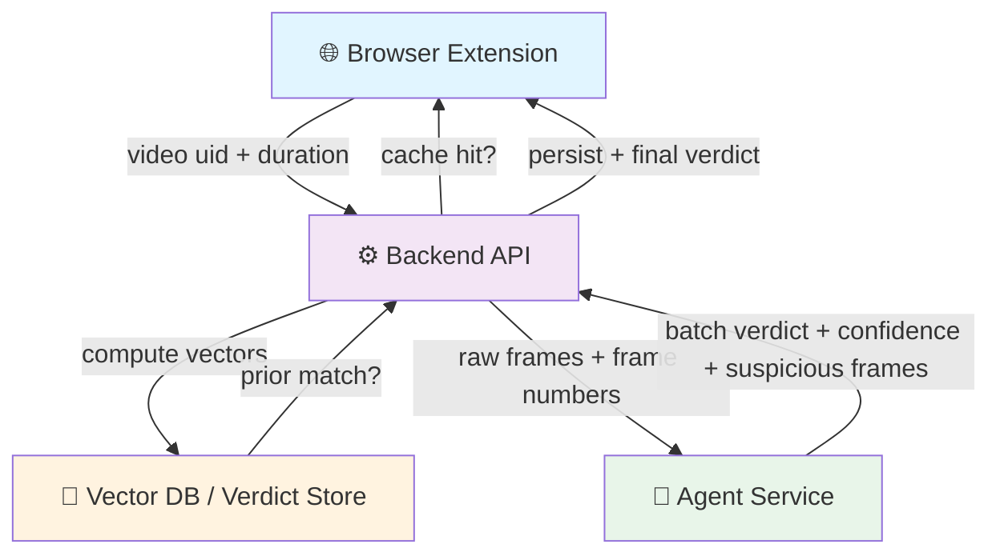

# 🎬 Deepfake Batch Agent Contract

> A strict forensic analysis service for video batch verification. The agent receives raw frames, analyzes temporal consistency, and returns a verdict with confidence.

**Quick Facts:**
- ✅ Raw frames only (no prebuilt grids)
- ✅ Continuous, global frame numbering
- ✅ JSON request/response contract
- ✅ Batch-level analysis (backend owns uid-level finalization)
- ✅ Python 3.11+ HTTP service w/ Gemini integration

---

## 📋 Table of Contents

- [⚡ Quick Start](#quick-start)
- [🏗️ System Architecture](#system-architecture)
- [👥 Roles & Responsibilities](#roles--responsibilities)
- [🔄 End-to-End Flow](#end-to-end-flow)
- [📡 Agent Interface & Contracts](#agent-interface--contracts)
  - [Request Format](#request-contract)
  - [Response Format](#agent-response-contract)
- [✔️ Validation Rules](#json-validation-rules)
- [📊 Batch Lifecycle](#batch-lifecycle)
- [🎨 Visual Frame Policy](#visual-frame-policy)
- [👋 Team Handoff Guide](#team-handoff-guide)
- [🏛️ Service Architecture](#service-architecture-suggested-boundaries)
- [🧪 Testing & CI](#testing--ci)
- [📚 Implementation Notes](#implementation-notes)
- [✨ Example Responses](#example-responses)

---

## ⚡ Quick Start

This document covers the `agent` module in the monorepo.

If you are at repository root, use the root wrapper scripts in `scripts/`.
If you are inside `agent/`, use the local scripts shown below.

### Prerequisites

- **Python 3.11+** (auto-installs if missing)
- **GEMINI_API_KEY** (required; get from [Google AI Studio](https://aistudio.google.com))

### Setup (30 seconds)

Run these commands from inside the `agent/` directory.

**PowerShell** (Windows):
```powershell
. .\scripts\setup.ps1
```

**Command Prompt** (Windows):
```cmd
scripts\setup.cmd
```

**macOS / Linux:**
```bash
chmod +x scripts/setup.sh scripts/activate.sh
./scripts/setup.sh
```

### Setup From Repository Root

If you are in repository root, run:

```powershell
. .\scripts\setup.ps1
```

```cmd
scripts\setup.cmd
```

```bash
chmod +x scripts/setup.sh scripts/activate.sh
./scripts/setup.sh
```

### Run the Service

```bash
# Start HTTP server on localhost:8000
deepfake-agent serve

# Or specify custom host/port:
deepfake-agent serve --host 127.0.0.1 --port 8080 --model-version agent-v1
```

### Test It

```bash
# Analyze a single batch from file
deepfake-agent analyze --input request.json

# Or from stdin
cat request.json | deepfake-agent analyze

# Analyze local images directly (files and/or folders)
deepfake-agent analyze-images ./frames
deepfake-agent analyze-images ./frame1.jpg ./frame2.png --uid demo_video_001

# Optionally save generated contact sheets + manifest for inspection
deepfake-agent analyze-images ./frames --save-grid-dir ./artifacts/manual_grids
```

### Environment Variables

Copy `.env.example` to `.env` and update:

```bash
GEMINI_API_KEY=sk_live_your_key_here        # REQUIRED
GEMINI_MODEL=gemini-3.1-flash-lite-preview  # default
REQUEST_TIMEOUT_SECONDS=90                  # timeout per request
```

---

## 🏗️ System Architecture



### Flow Summary

| Step | Actor | Action |
|------|-------|--------|
| **1** | Extension | Captures uid, duration; extracts frames |
| **2** | Backend | Checks cache for final verdict |
| **3** | Backend | Computes CLIP vectors; checks vector DB |
| **4** | Agent | Analyzes batch; returns verdict |
| **5** | Backend | Persists result; aggregates decision |
| **6** | Extension | Receives final verdict |

**Key Principle:** Batch-level verdicts are batch-level only. Uid-level finalization is backend responsibility.

### 📱 Extension Team

**Responsibility:** Frame capture and batching.

| What | How |
|------|-----|
| **Capture uid** | Extract video identifier from source URL early |
| **Capture duration** | Report total video length to backend |
| **Extract frames** | Use agreed sampling: 4 fps for first 5s, then 1 fps |
| **Batch & flush** | Collect 20 frames per batch; send when full or at end |
| **Numbering** | Maintain continuous 1-based frame numbers across video |
| **Browser cache** | Keep current batch in local storage; clear after send |

### ⚙️ Backend Team

**Responsibility:** Orchestration, retrieval, persistence, and uid-level finalization.

| What | How |
|------|-----|
| **Cache check** | Lookup stored final verdict for uid; return if exists |
| **Vector matching** | Compute CLIP vectors; query vector store for prior match |
| **Batch dispatch** | Send unmatched batches to agent with raw frames |
| **Result storage** | Persist deepfake verdicts immediately; store authentic as transient |
| **Finalization** | Promote to authentic only after full video + no deepfakes |

### 🔬 Agent Service

**Responsibility:** Visual forensic analysis of a batch only.

| What | How |
|------|-----|
| **Receive batch** | Accept raw frame images with global frame numbers |
| **Build grid** | Internally create contact sheet (5×4) for visual analysis |
| **Analyze** | Check temporal consistency, facial identity, plausibility |
| **Return verdict** | Respond with strict JSON (deepfake/authentic + confidence) |
| **Clean workspace** | Delete all transient frame files before response |
| **No persistence** | Never make uid-level or final decisions |

---

## 🔄 End-to-End Flow

```
1️⃣  Extension captures uid + duration
    ↓
2️⃣  Backend checks cache for final verdict
    ├─ HIT: Return immediately
    └─ MISS: Continue
    ↓
3️⃣  Extension extracts frames at 4fps (first 5s) then 1fps
    ↓
4️⃣  Extension batches frames (20 per batch), preserves frame numbers
    ↓
5️⃣  Backend receives batch, computes CLIP vectors
    ├─ Vector match found: Return matched verdict
    └─ No match: Continue
    ↓
6️⃣  Backend sends batch to Agent Service
    ↓
7️⃣  Agent builds contact sheet (5×4 grid), analyzes temporal consistency
    ↓
8️⃣  Agent returns: deepfake | authentic (with confidence)
    ↓
9️⃣  Backend stores result
    ├─ Deepfake: End session, return to extension
    └─ Authentic: Continue with next batch
    ↓
🔟 After all batches: Backend promotes to final authentic if no deepfake found
    ↓
🔑 Extension receives final verdict
```

### Sampling Schedule

- **First 5 seconds:** 4 fps → 20 frames
- **After 5 seconds:** 1 fps → N frames (depends on video length)
- **Batching:** 20-frame chunks sent to backend
- **Frame Numbering:** Global 1-based, never resets between batches

---

## 📡 Agent Interface & Contracts

The agent is exposed as a JSON-over-HTTP service.

**Endpoint:** `POST /v1/analyze/batch`

**Headers:**
```
Content-Type: application/json
Accept: application/json
X-Request-Id: <request-id>
```

### 📥 Request Contract

The backend sends a single JSON object per batch.

```json
{
  "request_id": "req_01J9X7K8V3Q8M8R1D4A5B6C7D8",
  "uid": "yt_abc123",
  "video_total_seconds": 183,
  "batch_index": 4,
  "batch_start_frame": 61,
  "batch_end_frame": 80,
  "is_final_batch": false,
  "frame_count": 20,
  "frames": [
    {
      "frame_number": 61,
      "timestamp_ms": 60000,
      "content_type": "image/jpeg",
      "image_base64": "/9j/4AAQSkZJRgABAQAAAQABAAD..."
    },
    {
      "frame_number": 62,
      "timestamp_ms": 61000,
      "content_type": "image/jpeg",
      "image_base64": "/9j/4AAQSkZJRgABAQAAAQABAAD..."
    }
  ],
  "vector_match": {
    "enabled": true,
    "match_found": false,
    "matched_verdict": null,
    "matched_uid": null
  }
}
```

**Field Reference:**

| Field | Type | Required | Rule |
|-------|------|----------|------|
| `request_id` | string | ✅ | Unique request-scoped idempotency key |
| `uid` | string | ✅ | Stable video identifier from extension/backend |
| `video_total_seconds` | integer | ✅ | Total duration reported by extension |
| `batch_index` | integer | ✅ | 1-based batch sequence number |
| `batch_start_frame` | integer | ✅ | Global 1-based frame number of first frame |
| `batch_end_frame` | integer | ✅ | Global 1-based frame number of last frame |
| `is_final_batch` | boolean | ✅ | True only for final partial or final full batch |
| `frame_count` | integer | ✅ | Number of frames in batch |
| `frames` | array | ✅ | Ordered list of raw frames |
| `frames[].frame_number` | integer | ✅ | Continuous 1-based frame number (global) |
| `frames[].timestamp_ms` | integer | ✅ | Capture time in milliseconds |
| `frames[].content_type` | string | ✅ | MIME type (e.g., `image/jpeg`) |
| `frames[].image_base64` | string | ✅ | Base64-encoded image bytes |
| `vector_match` | object | ❌ | Backend metadata for observability |

**Frame Ordering Rules:**
- Frames sorted by `frame_number` ascending
- Frame numbers never reset between batches
- Batch 1 begins with first sampled frame
- First 5 seconds: 20 frames at 4 fps
- After 5 seconds: 1 fps until end
- Treat batch as part of larger timeline (not isolated set)

### 📤 Agent Response Contract

The agent returns a single JSON object.

```json
{
  "request_id": "req_01J9X7K8V3Q8M8R1D4A5B6C7D8",
  "uid": "yt_abc123",
  "batch_index": 4,
  "batch_verdict": "deepfake",
  "confidence": 91,
  "suspicious_frame_numbers": [63, 64, 65, 72],
  "status": "ok",
  "model_version": "agent-v1",
  "notes": "Optional debug-only text for logs"
}
```

**Field Reference:**

| Field | Type | Required | Rule |
|-------|------|----------|------|
| `request_id` | string | ✅ | Must echo request id exactly |
| `uid` | string | ✅ | Must echo request uid exactly |
| `batch_index` | integer | ✅ | Must echo batch index exactly |
| `batch_verdict` | string | ✅ | Either `deepfake` or `authentic` |
| `confidence` | integer | ✅ | 0–100 confidence score |
| `suspicious_frame_numbers` | array | ✅ | Sorted, unique, global frame numbers |
| `status` | string | ✅ | `ok` for success; `error` for agent failure |
| `model_version` | string | ❌ | Traceability field (e.g., `gemini-v1`) |
| `notes` | string | ❌ | Debug-only text; backend ignores for decisions |

**Verdict Semantics:**

- **`deepfake`** → Current batch contains forensic evidence of manipulation
- **`authentic`** → Current batch does not contain evidence of manipulation
- **`confidence`** → Agent's confidence in verdict (batch-level, not video-level)
- **`suspicious_frame_numbers`** → Global frame numbers (empty array if authentic)

---

## ✔️ JSON Validation Rules

The backend should validate the response before acting on it:

- ✅ Response is valid JSON
- ✅ Echo fields (`request_id`, `uid`, `batch_index`) match request
- ✅ `batch_verdict` is `deepfake` or `authentic`
- ✅ `confidence` is integer 0–100
- ✅ `suspicious_frame_numbers` sorted, unique, ascending
- ✅ Frame numbers within batch range
- ✅ Extra fields logged but don't affect verdict

---

## 📊 Batch Lifecycle

Five possible paths through the batch lifecycle:

### 1️⃣ **Cache Hit Path**
```
Final verdict exists for uid → Return immediately
```

### 2️⃣ **Vector Match Path**
```
CLIP vectors match prior verdict → Return matched verdict immediately
Agent not called
```

### 3️⃣ **Agent Deepfake Path**
```
No vector match → Forward to agent → Agent returns deepfake
→ Store result → End session
```

### 4️⃣ **Agent Authentic Path**
```
No vector match → Forward to agent → Agent returns authentic
→ Store as transient → Continue with next batch
```

### 5️⃣ **Final Promotion Path**
```
All batches processed + no deepfakes found
→ Promote uid to final authentic → Return to extension
```

---

## 🎨 Visual Frame Policy

Treat the batch as a **timeline**, not a collage:

- ✅ Keep original frame geometry
- ✅ Do not crop content
- ✅ Preserve full frame in internal grids
- ✅ Preserve supplied frame order exactly
- ✅ Prefer temporal evidence over single-frame semantics

---

## 👋 Team Handoff Guide

### 📱 For The Extension Team

- Send `uid`, `video_total_seconds`, and continuous frame batches
- Preserve 1-based global frame numbering
- Use 20-frame batches; flush final partial batch
- Keep browser cache bounded to current batch
- Do not attempt verdict logic in client

### ⚙️ For The Backend Team

- Treat uid-level verdict storage as authoritative
- Treat vector matches as fast-path verdict reuse
- Treat agent as batch-level analysis service only
- Reject malformed responses (don't guess)
- Persist metadata for replay and audit

### 🔬 For The Agent Team

- Accept JSON requests only
- Expect raw frame payloads with continuous numbering
- Return JSON only
- Keep output small, deterministic, machine-parseable
- Separate batch verdict from video-level finalization

---

## 🏛️ Service Architecture (Suggested Boundaries)

Recommended module split:

```
agent-service/
├── api/
│   ├── request_validation.py
│   └── response_serialization.py
├── inference/
│   ├── frame_normalization.py
│   ├── grid_builder.py
│   ├── temporal_analysis.py
│   └── verdict_synthesis.py
├── contracts/
│   ├── json_schema.py
│   └── enums.py
└── observability/
    ├── request_logging.py
    ├── model_tracing.py
    └── audit_metadata.py
```

---

## 🧪 Testing & CI

GitHub Actions runs the test suite on both Linux and Windows across Python 3.11+ using [../.github/workflows/tests.yml](../.github/workflows/tests.yml).

Run tests locally:
```bash
pytest -v
```

---

## 📚 Implementation Notes

1. **Stateless HTTP service** – No session state; idempotent on request_id
2. **Schema validation at API boundary** – Reject invalid requests early
3. **Single internal interface** – Keep model logic behind one abstraction
4. **Response serializer owns output shape** – Single source of truth
5. **Observability first** – Log `uid`, `request_id`, `batch_index` always
6. **Separate debug from contract** – Store reasoning in `notes`, not verdict fields
7. **Rich test fixtures** – Cache-hit, vector-match, authentic-batch, deepfake-batch scenarios

---

## ✨ Example Responses

### ✅ Authentic Verdict

```json
{
  "request_id": "req_01J9X7K8V3Q8M8R1D4A5B6C7D8",
  "uid": "yt_abc123",
  "batch_index": 4,
  "batch_verdict": "authentic",
  "confidence": 78,
  "suspicious_frame_numbers": [],
  "status": "ok"
}
```

### ❌ Deepfake Verdict

```json
{
  "request_id": "req_01J9X7K8V3Q8M8R1D4A5B6C7D8",
  "uid": "yt_abc123",
  "batch_index": 4,
  "batch_verdict": "deepfake",
  "confidence": 93,
  "suspicious_frame_numbers": [63, 64, 65, 72],
  "status": "ok"
}
```
